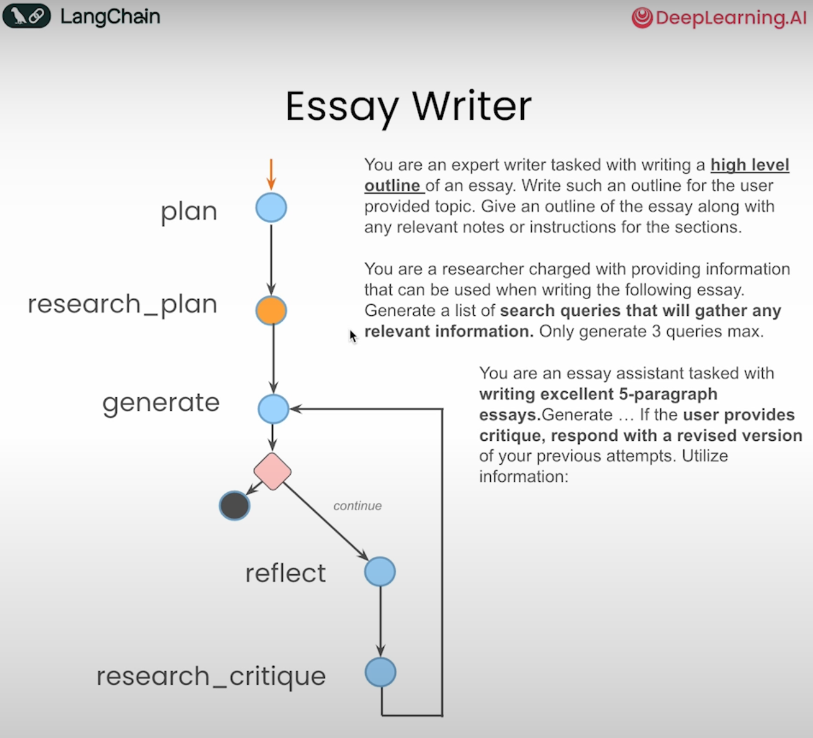

# langgraph-agents

> From the [DeepLearning.AI short course on AI Agents in LangGraph](https://learn.deeplearning.ai/courses/ai-agents-in-langgraph/)

Playing with LangGraph agents

### Essay writer

One of the projects in the course is to write an essay on a given topic. The essay is structured as a graph, with the following nodes:

